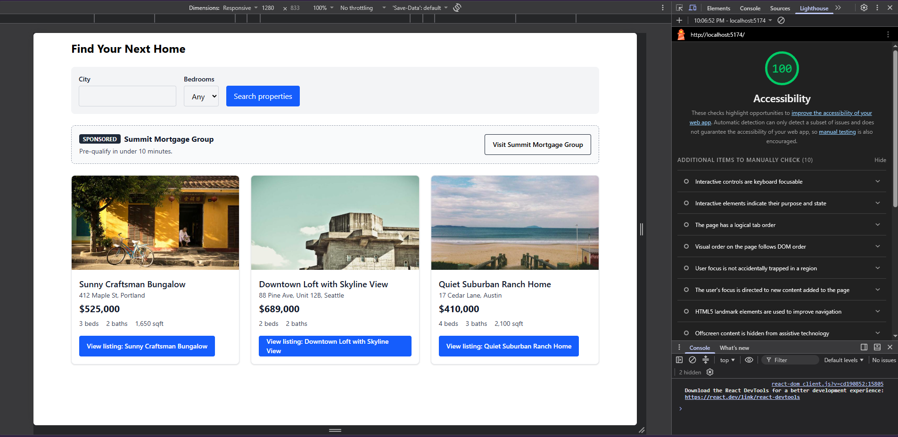
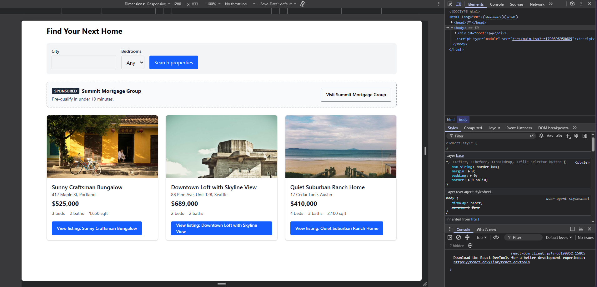
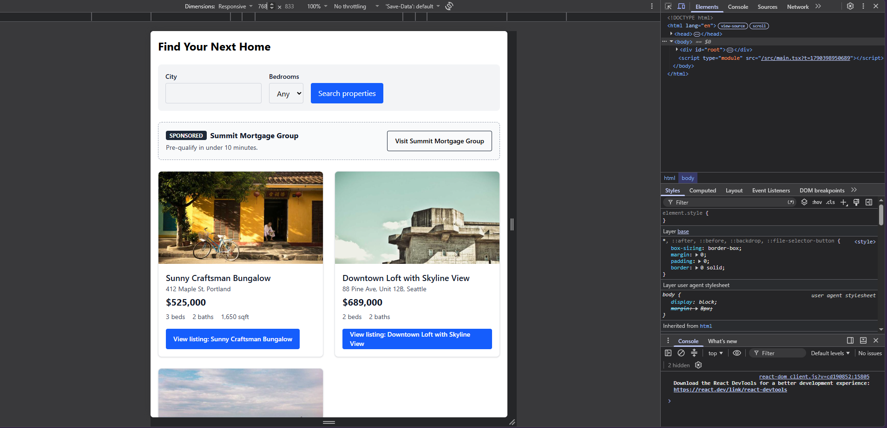
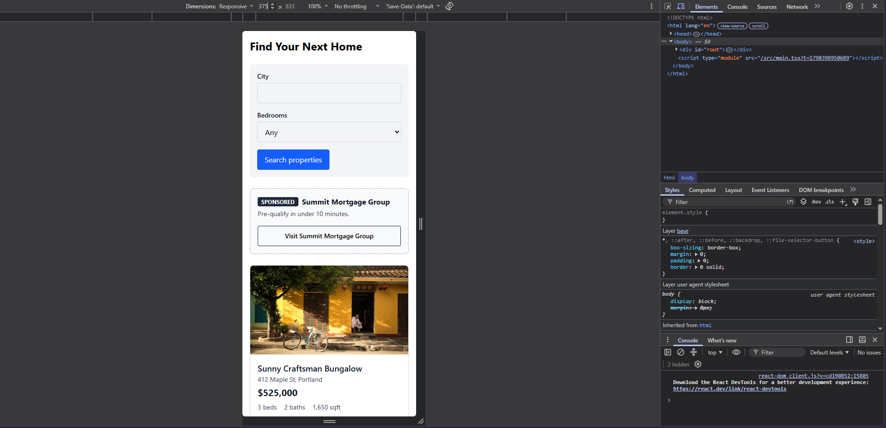

## 
## 
## 
## 
## 
## 


Prompt: Review this React component for semantic HTML, WCAG-oriented keyboard access, responsive behavior, and TypeScript safety. Return: issue, why it matters, smallest change, and a manual test. Do not claim compliance from code alone.


## PropertyCard — ChatGPT
Output: Overall, the component is structurally solid, but there are a few accessibility and TypeScript edge cases worth addressing. These are code-level observations; **they do not establish WCAG compliance without testing the rendered UI, keyboard behavior, contrast, zoom/reflow, and assistive-technology experience.**

 | Issue | Why it matters | Smallest change | Manual test |
| --- | --- | --- | --- |
| `property.imageAlt` may be inappropriate for a decorative image | If the image conveys no information beyond the listing title/details, redundant alt text can create unnecessary screen-reader output. Conversely, an empty alt would be wrong if the image communicates useful information. | Decide based on the image's purpose. For decorative imagery: `alt=""`. For meaningful imagery: keep a concise, meaningful `alt`. | With a screen reader, navigate through the card and verify the image announcement adds useful information rather than repeating the title. |
| Heading level is hard-coded as `<h2>` | A reusable card shouldn't assume the surrounding page's heading hierarchy. If cards appear under an `<h3>`, for example, inserting `<h2>` can create an illogical document outline. | Pass an appropriate heading level/component from the parent, or use the card only where `<h2>` is actually correct. | Inspect the rendered page's heading structure with a screen reader or accessibility-tree/heading-list tool. |
| `property.sqft && ...` uses truthiness | A value of `0` is omitted. More importantly, if `sqft` is typed as a nullable/optional value, the rendering behavior should be intentional rather than relying on truthiness. | If absence is the criterion, use `{property.sqft != null && ...}`. | Render cards with `sqft` equal to `0`, `undefined`, and `null` (as applicable) and verify the intended output. |
| `property.price.toLocaleString()` assumes `price` is a valid number | TypeScript only protects this if `Property.price` is correctly typed. Runtime API data can still violate the type, causing a render error. | Validate/normalize API data at the boundary; at minimum, ensure `price: number` is guaranteed by the `Property` type and data parser. | Feed the component malformed/missing price data and verify the application handles it without crashing. |
| Link focus styling depends on the surrounding CSS/Tailwind setup | `focus-visible:outline` provides an outline, but the actual visual distinction should be verified against the page background and other states. Keyboard focus must remain visible. | Keep the existing `focus-visible` styles, but verify the resulting rendered focus indicator; if needed, strengthen it with a clearly contrasting ring. | Press `Tab` through the page. Confirm the link has an obvious visible focus indicator and that focus isn't obscured. |
| No explicit responsive handling for long content | The card can encounter long titles, addresses, or unusually large numbers. `w-full` and `aspect-video` help, but flex/list and text wrapping should be tested rather than assumed. | Usually no change if normal wrapping is desired; add appropriate wrapping/truncation only if the design requires it. | Test very long titles/addresses and large prices at narrow widths and at 200–400% browser zoom. Verify nothing overlaps or becomes inaccessible. |
| `<ul className="flex gap-4">` has no responsive/wrapping behavior | Three metrics can become cramped or overflow at narrow widths, particularly with localized or larger text. | Consider `flex-wrap` if the design permits: `className="mt-2 flex flex-wrap gap-4 text-sm text-gray-700"`. | Test around mobile widths and with browser text zoom. Verify every metric remains readable without horizontal scrolling. |
| Link text repeats the heading | “View listing: \[title\]” is technically understandable, but repeated title text can make link lists verbose for screen-reader users. | If the card title is already the accessible context, `aria-label` could shorten the link—but this isn't necessarily an improvement. Keeping the explicit title is a reasonable default. | In a screen reader's links list, verify each link is uniquely understandable without relying on surrounding visual context. |

### One TypeScript-specific point

 The strongest TypeScript improvement is **at the data boundary rather than inside this component**. If `Property` represents trusted, already-validated application data, the component can reasonably assume `price` is a number and `url` is a string. If `Property` is merely an interface applied to untrusted API JSON, TypeScript does not provide runtime safety.

 For example, this is meaningful:

```
interface Property {
  price: number;
  imageUrl: string;
  imageAlt: string;
  title: string;
  address: string;
  city: string;
  beds: number;
  baths: number;
  sqft?: number;
  url: string;
}
```

 —but it still doesn't validate JSON received from a server. Runtime validation/normalization should happen before data reaches `PropertyCard`.

 ### Highest-value small change

 I'd make the square-footage condition explicit and allow wrapping:

```
<ul className="mt-2 flex flex-wrap gap-4 text-sm text-gray-700">
  <li>{property.beds} beds</li>
  <li>{property.baths} baths</li>
  {property.sqft != null && <li>{property.sqft} sqft</li>}
</ul>
```

 That addresses a concrete rendering edge case and improves narrow-screen resilience without changing the component's structure.
Kept: sqft ! = null check, flex-wrap on facts list
Rejected: 

## PropertyCard — Gemini
Output: Here is the review of the `PropertyCard` component, broken down by issue.

---

### 1. TypeScript Safety: Missing Properties on `Property` Interface

* **Issue:** `property.imageAlt` is referenced in `alt={property.imageAlt}`, but `imageAlt` was not defined on the `Property` interface. Furthermore, `property.imageUrl` is optional (`string | undefined`), which can pass `undefined` into the `src` attribute.
* **Why it matters:** Referencing non-existent properties causes TypeScript compile errors. Passing `undefined` to `img.src` breaks image rendering and can cause unnecessary image loads.
* **Smallest change:** Update the component to handle optional `imageUrl` and fall back gracefully, or update the interface if `imageAlt` is intended.

```tsx
{/* Inside PropertyCard */}
{property.imageUrl && (
  
)}

```

* **Manual Test:** Pass a `property` object where `imageUrl` is `undefined` into the component. Verify that TypeScript compiles without error and the `` tag is cleanly omitted without breaking the layout.

---

### 2. WCAG / Responsive: Image Alt Text Redundancy & Decorative Fallback

* **Issue:** The image `alt` attribute uses `property.imageAlt` (which isn't on the type). If made decorative or defaulted to title text, screen readers repeat identical information already present in the `<h2>` and link anchor text.
* **Why it matters:** Repeating the property title inside the image `alt`, `<h2>`, and link anchor text causes unnecessary verbosity for screen reader users when tabbing or navigating by headings/graphics.
* **Smallest change:** Use empty alt text (`alt=""`) if the image is purely visual/decorative, or provide meaningful context distinct from the title.

```tsx


```

* **Manual Test:** Enable a screen reader (e.g., VoiceOver or NVDA). Tab through the card and listen to the announcement. Ensure the title is not read twice sequentially.

---

### 3. WCAG / Semantic HTML: Redundant Link Context

* **Issue:** The anchor text `<a ...>View listing: {property.title}</a>` repeats the `<h2>` title directly above it.
* **Why it matters:** Repeating long titles inside button/link text creates screen reader fatigue and clutters spatial layouts on small screens.
* **Smallest change:** Use `aria-label` or `aria-labelledby` to associate the link action cleanly with the heading without duplicating the visual text.

```tsx
<a
  href={property.url}
  aria-label={`View listing for ${property.title}`}
  className="mt-4 inline-block rounded bg-blue-600 px-4 py-2 text-white hover:bg-blue-700 focus-visible:outline focus-visible:outline-2 focus-visible:outline-offset-2 focus-visible:outline-blue-600"
>
  View listing
</a>

```

* **Manual Test:** Tab to the link with a screen reader active. Verify it announces "View listing for [Title], link" clearly while visually remaining compact as "View listing".

---

### 4. WCAG: Interactive Surface & Clickable Target Area

* **Issue:** Only the "View listing" link is interactive. Users clicking the image, heading, or card container cannot navigate to the property.
* **Why it matters:** On mobile viewports, small button-only tap targets increase misclicks and fail WCAG 2.5.8 (Pointer Target Spacing / Minimum Size) expectations for primary card interactions.
* **Smallest change:** Make the main heading or full card area actionable using a stretched link pattern.

```tsx
<article className="relative rounded-lg border border-gray-200 bg-white shadow-sm">
  {/* Image and content */}
  <h2 className="text-lg font-semibold">
    <a href={property.url} className="after:absolute after:inset-0 focus:outline-none">
      {property.title}
    </a>
  </h2>
  {/* Other details */}
</article>

```

* **Manual Test:** Hover over and tap anywhere on the card container on a touch device. Verify that the whole card acts as a single tap target and navigates to `property.url`.

---

### 5. Responsive Behavior: Text Overflow & Container Boundaries

* **Issue:** Long strings in `property.title` or `property.address` without truncation or word-break rules can overflow the card boundary on narrow mobile screens (320px).
* **Why it matters:** Layout breaking creates horizontal scrollbars and obscures pricing/feature info.
* **Smallest change:** Add text truncation and flex/grid containment classes to the textual wrappers.

```tsx
<h2 className="truncate text-lg font-semibold" title={property.title}>
  {property.title}
</h2>
<p className="truncate text-sm text-gray-600">
  {property.address}, {property.city}
</p>

```

* **Manual Test:** Pass an extremely long property title (e.g., 100+ characters) into the component. Resize the browser viewport down to 320px width and check for text clipping or horizontal overflow.

---

### 6. WCAG: Color Contrast Verification

* **Issue:** `text-gray-600` (`#4B5563`) on a white background yields a contrast ratio of ~4.6:1, which passes WCAG AA (4.5:1) for normal text, but `text-gray-700` (`#374151`) is safer for small body text across variable display color profiles.
* **Why it matters:** Slight monitor calibration differences or low ambient lighting can make `#4B5563` hard to read for users with low vision.
* **Smallest change:** Darken secondary text slightly for better legibility contrast.

```tsx
<p className="text-sm text-gray-700">{property.address}, {property.city}</p>

```

* **Manual Test:** Run an automated accessibility tool (e.g., axe DevTools or Lighthouse) against the rendered component and verify zero contrast-related warnings.

---
Kept: overflow-hidden on root, loading="lazy", truncate + title on h2/address, gap-x-4 gap-y-1 on facts list, min-h-[ 44 px] touch target, sqft.toLocaleString()
Rejected: alt=""


## SponsorBanner — ChatGPT
Output: ## Review

 | Issue | Why it matters | Smallest change | Manual test |
| --- | --- | --- | --- |
| `aria-label="Sponsored content"` may duplicate the visible “Sponsored” label | Screen-reader users can hear both the landmark label and the visible content. It isn't necessarily wrong, but it can be redundant. | Keep it if this banner is intentionally a labeled complementary region. Otherwise remove the `aria-label` from the `<aside>`. | With a screen reader, navigate by landmarks and confirm the banner is announced usefully without unnecessary repetition. |
| `<strong>` is being used for the business name | `<strong>` conveys importance, not heading structure. If the sponsor banner is a distinct section with a meaningful title, a heading may better represent its structure. | If the business name functions as the banner's heading, change `<strong>` to an appropriate heading, e.g. `<h2>`. | Navigate headings with a screen reader and verify the sponsor banner has an appropriate place in the page's heading hierarchy. |
| Focus styling is incomplete/implicit | The link has an outline width/color, but the color isn't explicitly specified. Its visibility therefore depends on the browser/Tailwind defaults and surrounding colors. | Specify the focus color, e.g. `focus-visible:outline-gray-900`. | Use only `Tab` to reach the link and confirm the focus indicator is clearly visible against both the banner and surrounding page. |
| `flex items-center justify-between` can become cramped on narrow screens | A long business name/tagline plus the fixed-width link can cause awkward wrapping or horizontal overflow. | Add `flex-wrap`, e.g. `flex flex-wrap items-center justify-between`. | Test narrow mobile widths, long sponsor names, and 200–400% zoom. Confirm no content is clipped or requires unintended horizontal scrolling. |
| `sponsor.businessName` is repeated in the link | This is accessible and understandable, but can become verbose in a screen-reader links list. | **No change initially.** Keep the explicit link text unless testing shows it is problematic. | Use a screen reader's links list and verify `Visit [business name]` uniquely identifies the destination. |
| `sponsor.url` is assumed to be a valid URL | TypeScript's `Sponsor` interface does not validate runtime data. Bad external data can produce an invalid link. | Validate/normalize sponsor data when it enters the application rather than inside this presentational component. | Test malformed/missing URL data at the data boundary and verify the application handles it appropriately. |
| `tagline` is rendered as a `<p>` but may be absent | If `tagline` is optional in `Sponsor`, rendering `undefined` produces an empty paragraph. | If optional, conditionally render it: `{sponsor.tagline && <p>...</p>}`. | Test a sponsor with no tagline and verify there isn't an unnecessary empty paragraph or unexpected spacing. |

## What I'd change

 The two lowest-risk changes are responsive wrapping and explicit focus styling:

```
<aside
  aria-label="Sponsored content"
  className="flex flex-wrap items-center justify-between gap-4 rounded-lg border border-dashed border-gray-400 bg-gray-50 p-4"
>
```

 and:

```
<a
  href={sponsor.url}
  className="shrink-0 rounded border border-gray-800 px-4 py-2 text-sm font-medium hover:bg-gray-100 focus-visible:outline focus-visible:outline-2 focus-visible:outline-offset-2 focus-visible:outline-gray-900"
>
```

 I would **not automatically change `<strong>` to `<h2>`**. That depends on the banner's place in the surrounding document's heading hierarchy. Likewise, I wouldn't add ARIA to the link or introduce runtime validation here without evidence that the application needs it.

 As with the previous component, these are code-level observations—not a WCAG compliance determination. Verify the rendered component with keyboard navigation, a screen reader, zoom/reflow, long content, and contrast testing.
Kept: focus-visible:outline-gray-900
Rejected: < strong > → < h2 >, aria-label removal

## SponsorBanner — Gemini
Output: Here is the code review for the `SponsorBanner` component.

---

### 1. TypeScript Safety: Unhandled Optional Properties (`tagline` and `logoUrl`)

* **Issue:** `sponsor.tagline` is rendered directly into `<p>`, but `tagline` is marked optional (`string | undefined`) in the `Sponsor` type definition. Additionally, `sponsor.logoUrl` is completely omitted from the UI despite being part of the `Sponsor` model.
* **Why it matters:** Rendering `undefined` in React creates an empty `<p>` tag (`<p class="text-sm text-gray-600"></p>`), which causes awkward vertical spacing/margins. Furthermore, completely ignoring available branding (`logoUrl`) leads to inconsistent visual design when logos are present.
* **Smallest change:** Conditionally render the tagline paragraph only when `sponsor.tagline` exists, and optionally render the logo image if provided.

```tsx
{sponsor.tagline && (
  <p className="text-sm text-gray-600">{sponsor.tagline}</p>
)}

```

* **Manual Test:** Pass a `sponsor` object where `tagline` is `undefined`. Inspect the DOM to ensure no empty `<p>` element is created, and verify that vertical alignment and line spacing remain visually balanced.

---

### 2. WCAG / Keyboard Access: Non-Compliant Touch & Click Target Size

* **Issue:** The `<a>` element has padding `px-4 py-2` on a `text-sm` font, resulting in an interactive height of roughly $36\text{px}$.
* **Why it matters:** WCAG 2.1 Success Criterion 2.5.8 (Target Size - Minimum) requires interactive target sizes to be at least $24 \times 24\text{px}$, while WCAG 2.2 AAA and mobile platform standards (Apple/Google) recommend a minimum tap target of $44 \times 44\text{px}$ or $48 \times 48\text{px}$. Small buttons cause mis-taps for users with motor impairments or those on mobile devices.
* **Smallest change:** Add `min-h-[44px]` and centering classes to guarantee a sufficient tap/click area without breaking layout alignment.

```tsx
<a
  href={sponsor.url}
  className="inline-flex min-h-[44px] shrink-0 items-center justify-center rounded border border-gray-800 px-4 py-2 text-sm font-medium hover:bg-gray-100 focus-visible:outline focus-visible:outline-2 focus-visible:outline-offset-2"
>
  Visit {sponsor.businessName}
</a>

```

* **Manual Test:** Open mobile emulator in browser developer tools (or test on an actual touchscreen device). Verify with element inspection that the bounding client rectangle of the link is at least $44\text{px}$ tall.

---

### 3. Responsive Behavior: Flex Overflow & Text Truncation on Small Viewports

* **Issue:** The container uses `flex items-center justify-between gap-4`. On small viewports ($320\text{px}$–$375\text{px}$), a long `businessName` or `tagline` combined with `shrink-0` on the link will squeeze text off-screen or cause awkward multi-line text collisions.
* **Why it matters:** Text wrapping squeezed against fixed-width action buttons causes layout breakage, unintended vertical height blowing out, or clipped words on small screens.
* **Smallest change:** Change the flex layout to stack vertically on small screens (`flex-col sm:flex-row`) or allow min-width containment with truncation.

```tsx
<aside
  aria-label="Sponsored content"
  className="flex flex-col gap-4 rounded-lg border border-dashed border-gray-400 bg-gray-50 p-4 sm:flex-row sm:items-center sm:justify-between"
>
  <div className="min-w-0">
    <div className="flex items-center gap-2">
      <span className="shrink-0 rounded bg-gray-800 px-2 py-0.5 text-xs font-bold uppercase text-white">
        Sponsored
      </span>
      <strong className="truncate">{sponsor.businessName}</strong>
    </div>
    {sponsor.tagline && (
      <p className="mt-1 truncate text-sm text-gray-600">{sponsor.tagline}</p>
    )}
  </div>
  {/* Link element */}
</aside>

```

* **Manual Test:** Set screen width to $320\text{px}$ in DevTools. Pass a long `businessName` ("Acme Global Logistics & Enterprise Infrastructure Solutions"). Verify that the component stacks vertically or truncates smoothly without causing horizontal page scrolling.

---

### 4. WCAG: Secondary Color Contrast Buffer

* **Issue:** `<p className="text-sm text-gray-600">` produces `#4B5563` on `#F9FAFB` (`bg-gray-50`), giving a contrast ratio of ~4.51:1.
* **Why it matters:** While 4.51:1 technically meets WCAG 2.1 AA minimums (4.5:1), it sits on the extreme edge of compliance. On screens with low contrast calibration or in bright sunlight, light gray text on off-white backgrounds becomes difficult to read for low-vision users.
* **Smallest change:** Change `text-gray-600` to `text-gray-700` (`#374151`) to raise the contrast ratio comfortably above 7:1.

```tsx
<p className="mt-1 truncate text-sm text-gray-700">{sponsor.tagline}</p>

```

* **Manual Test:** Run Lighthouse or axe DevTools color contrast auditor on the rendered element to ensure no contrast warnings or threshold alerts are flagged.

---

### 5. Semantic HTML / Screen Reader Context: Generic `<strong>` Tag Structure

* **Issue:** `<strong>{sponsor.businessName}</strong>` sits inline next to the `<span>Sponsored</span>` badge without block or structural grouping.
* **Why it matters:** Screen readers process inline elements in sequence without structural pauses. Without a heading tag (`<h3>` or similar) or proper wrapper, screen readers announce "Sponsored Acme Inc" as a continuous phrase, making navigation by page landmarks/headings harder for screen reader users.
* **Smallest change:** Wrap the sponsor name in a heading or structural element, or use proper text separation.

```tsx
<div className="flex items-center gap-2">
  <span className="shrink-0 rounded bg-gray-800 px-2 py-0.5 text-xs font-bold uppercase text-white">
    Sponsored
  </span>
  <h3 className="truncate font-bold text-gray-900">{sponsor.businessName}</h3>
</div>

```

* **Manual Test:** Enable screen reader (VoiceOver / NVDA) and navigate using shortcut keys for regions/landmarks (`D` key in NVDA/VoiceOver). Confirm the `aside` landmark is announced with its label ("Sponsored content region") and headings inside are navigable.

---
Kept: flex-col sm:flex-row responsive stacking, min-w-0 + truncate on business name, Conditional {sponsor.tagline && ...}, text-gray-700 for tagline contrast
Rejected: < strong > → < h3 >, min-h-[ 44px ] + centering on link

## SearchFilters — ChatGPT
Output: ## Review

 | Issue | Why it matters | Smallest change | Manual test |
| --- | --- | --- | --- |
| `onSubmit={(e) => e.preventDefault()}` prevents the form's default submission but does nothing else | Activating **Search properties** appears to succeed, but no search occurs. This can be confusing for keyboard and assistive-technology users. | Either implement the search in `onSubmit`, or, if this is intentionally a UI-only component, document/connect the callback from the parent. Prefer a prop such as `onSearch`. | Enter a city, choose bedrooms, press `Enter` from an input, and activate the button with `Enter`/`Space`. Verify the search actually occurs and feedback is provided. |
| Focus outlines don't specify a color | `focus-visible:outline-2` establishes width but leaves the color to the browser/Tailwind defaults. The indicator may not be sufficiently distinct against the background. | Add an explicit contrasting color, e.g. `focus-visible:outline-gray-900`. | Tab through every control and verify the focus indicator is clearly visible against both the control and surrounding background. |
| No visible focus offset on inputs/select | The outline can sit directly against the control's border, making it harder to distinguish. | Add `focus-visible:outline-offset-2` to the input and select. | Tab through the controls at normal and high zoom and confirm focus remains obvious. |
| Responsive wrapping is good, but individual controls have no minimum/controlled width | At narrow widths, especially with browser text zoom, controls can become awkwardly narrow or labels/content can wrap unexpectedly. | Test before changing. If the design requires it, give controls an appropriate width such as `w-full sm:w-auto`. | Test narrow mobile widths and 200–400% zoom. Confirm labels and controls remain usable without clipping or unintended horizontal scrolling. |
| The form has no programmatic grouping/name | The controls are correctly labeled individually, so this isn't inherently an accessibility failure. However, if the surrounding page has several forms/filter regions, identifying this region can help navigation. | If it is a distinct page region, consider `<fieldset><legend>Property filters</legend>...`; otherwise leave it alone. | With a screen reader, navigate through landmarks/forms and determine whether the purpose of this group is clear. |
| TypeScript safety is straightforward | There are no props or external values, so there isn't an obvious TypeScript issue in this component. The event parameter is correctly inferred by React. | **No change.** | Run `tsc --noEmit` (or the project's equivalent) and verify there are no type errors. |

### One important semantic point

 The existing labels are correctly associated:

```
<label htmlFor="city">City</label>
<input id="city" ... />
```

 and:

```
<label htmlFor="beds">Bedrooms</label>
<select id="beds" ...>
```

 So I **wouldn't add `aria-label` or `aria-labelledby`**. Doing so would be redundant and could make the accessible naming model harder to maintain.

 ### Smallest practical update

 I'd start with explicit focus styling rather than restructuring the component:

```
<input
  id="city"
  name="city"
  type="text"
  className="rounded border border-gray-300 px-3 py-2 focus-visible:outline focus-visible:outline-2 focus-visible:outline-offset-2 focus-visible:outline-gray-900"
/>
```

 and the equivalent change to `<select>` and `<button>`.

 The bigger question is the `preventDefault()`: **if this form is supposed to perform a search, that is the functional issue I'd address first.** A keyboard user submitting the form should get the same result as someone clicking the button.

 As requested, none of these observations establish WCAG compliance from the source alone. The rendered form still needs keyboard, screen-reader, zoom/reflow, and contrast testing.
Kept: Explicit focus-visible:outline-blue-600 + offset
Rejected: < fieldset >< legend > grouping

## SearchFilters — Gemini
Output: Here is the code review for the `SearchFilters` component.

---

### 1. WCAG / Keyboard Access: Missing Contrast Offset for Form Inputs

* **Issue:** The `<input>` and `<select>` elements use `focus-visible:outline focus-visible:outline-2` without specifying an outline color, color offset, or custom focus ring (like `focus-visible:outline-blue-600 focus-visible:outline-offset-2`).
* **Why it matters:** Relying on default browser outlines across custom background containers (`bg-gray-100`) often results in standard browser outlines (like light blue in Chrome or black in Safari) blending into adjacent border colors or failing the 3:1 focus indicator contrast ratio required by WCAG 2.1 SC 2.4.11 (Focus Appearance).
* **Smallest change:** Standardize focus rings on form controls with explicit focus colors and offset utilities matching the submit button.

```tsx
<input
  id="city"
  name="city"
  type="text"
  className="rounded border border-gray-300 px-3 py-2 focus-visible:outline focus-visible:outline-2 focus-visible:outline-offset-2 focus-visible:outline-blue-600"
/>

```

* **Manual Test:** Use `Tab` to focus each input field and select dropdown. Verify that a high-contrast focus outline appears clearly against both the input box and the `bg-gray-100` background container.

---

### 2. Keyboard Access & Touch Targets: Sub-Minimum Target Size on Inputs & Selects

* **Issue:** Default text inputs and `<select>` elements with standard `py-2` ($8\text{px}$ top/bottom) and font size yield a rendered height of around $38\text{px}$ to $40\text{px}$.
* **Why it matters:** While close to the WCAG 2.1 AA requirement of $24 \times 24\text{px}$, it falls short of the recommended minimum tap target of $44 \times 44\text{px}$ (WCAG 2.2 AAA / Apple & Google Human Interface Guidelines) for touch devices. Small controls lead to mis-taps on mobile devices.
* **Smallest change:** Add `min-h-[44px]` to all interactive form controls (`<input>`, `<select>`, and `<button>`).

```tsx
<input
  id="city"
  name="city"
  type="text"
  className="min-h-[44px] rounded border border-gray-300 px-3 py-2 focus-visible:outline focus-visible:outline-2 focus-visible:outline-offset-2 focus-visible:outline-blue-600"
/>

```

* **Manual Test:** Inspect the rendered DOM elements using Chrome DevTools in Mobile Device Mode. Confirm that the bounding box height for inputs, selects, and buttons is at least $44\text{px}$.

---

### 3. Responsive Behavior: Form Inputs Contracting & Overflowing on Small Screens

* **Issue:** The parent form uses `flex flex-wrap items-end gap-4`. Without explicit layout or width rules (`w-full` or `flex-1`) on child container wrappers, form controls shrink to their content size or misalign awkwardly when stacked on $320\text{px}$–$375\text{px}$ screens.
* **Why it matters:** On small screens, fixed or unconstrained flex items squeeze unequally, creating irregular input lengths and jagged form margins.
* **Smallest change:** Make field groups stretch full width on narrow viewports while allowing flex-row wrapping on larger screens (`w-full sm:w-auto`).

```tsx
<div className="flex w-full flex-col sm:w-auto sm:flex-1">
  <label htmlFor="city" className="mb-1 text-sm font-medium text-gray-900">City</label>
  <input
    id="city"
    name="city"
    type="text"
    className="min-h-[44px] w-full rounded border border-gray-300 px-3 py-2 focus-visible:outline focus-visible:outline-2 focus-visible:outline-offset-2 focus-visible:outline-blue-600"
  />
</div>

```

* **Manual Test:** Set DevTools viewport width to $320\text{px}$. Verify that form fields stack vertically cleanly, span the full width of the container, and avoid horizontal overflow.

---

### 4. TypeScript Safety & Semantic HTML: Uncontrolled Form Without Action/Handler Props

* **Issue:** `SearchFilters` takes no props, has no `onChange`/`onSubmit` state handler callback passed down, and performs only `e.preventDefault()`. Furthermore, input controls are uncontrolled without `defaultValue` or state bindings.
* **Why it matters:** While syntactically valid TypeScript, a form component isolated from event handlers or React state cannot share filter state with parent components (like property search results), reducing reusability and type safety across pages.
* **Smallest change:** Define a typed `Props` interface accepting an `onSearch` submit handler that passes structured search values.

```tsx
export interface FilterValues {
  city: string;
  beds: string;
}

interface Props {
  onSearch?: (filters: FilterValues) => void;
}

export default function SearchFilters({ onSearch }: Props) {
  const handleSubmit = (e: React.FormEvent<HTMLFormElement>) => {
    e.preventDefault();
    const formData = new FormData(e.currentTarget);
    const filters: FilterValues = {
      city: formData.get('city') as string ?? '',
      beds: formData.get('beds') as string ?? '',
    };
    onSearch?.(filters);
  };

  return (
    <form className="flex flex-wrap items-end gap-4 rounded-lg bg-gray-100 p-4" onSubmit={handleSubmit}>
      {/* Inputs */}
    </form>
  );
}

```

* **Manual Test:** Submit the form with input data typed into the fields and verify in React DevTools or console output that `onSearch` receives the typed `FilterValues` payload correctly.

---

### 5. Semantic HTML: Lack of Group Landmark / Fieldset Metadata

* **Issue:** The form acts as a filter control panel without an explicit accessible landmark name (`aria-label`) or heading.
* **Why it matters:** Screen reader users navigating by landmarks (`F` or `D` keys) will hear "Form" without contextual clarity on what the form filters.
* **Smallest change:** Add an `aria-label` attribute to the `<form>` element.

```tsx
<form
  aria-label="Property search filters"
  className="flex flex-wrap items-end gap-4 rounded-lg bg-gray-100 p-4"
  onSubmit={handleSubmit}
>

```

* **Manual Test:** Turn on VoiceOver or NVDA, press the landmark navigation shortcut key, and verify that the screen reader announces "Property search filters, form".

---

Kept: w-full sm:w-auto on field wrappers, min-h-[ 44px ] on all controls, Explicit focus-visible:outline-blue-600 + offset, aria-label="Property search filters" on form, text-gray-900 on labels
Rejected: onSearch prop + FormData handler